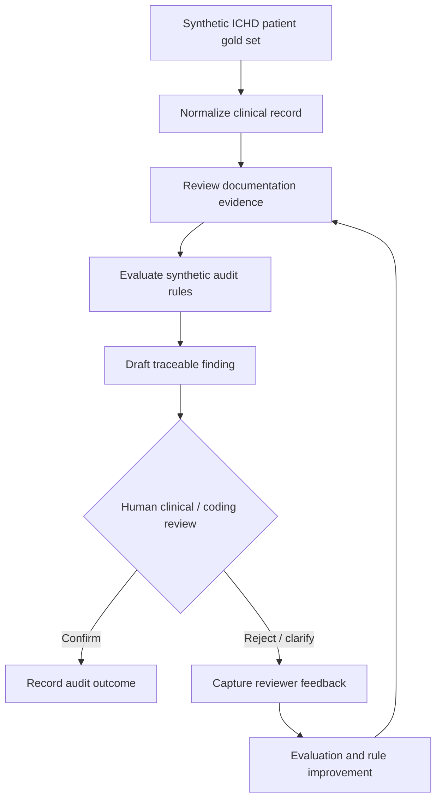

#  In-center hemodialysis (ICHD) Clinical Documentation Audit

> **Synthetic demonstration only.** Every patient, encounter, treatment, note, audit rule, evidence item, and finding in this repository is fictional mock data. This POC contains no client data, proprietary logic, production code, or client deliverables.

## Purpose

This POC demonstrates a governed, workflow-first AI approach to clinical documentation audit for a single modality: **in-center hemodialysis (ICHD)**. It turns a synthetic patient record into traceable audit findings for human review.

It is an architectural communication artifact, not a clinical decision system and not a production implementation.

## Workflow

## What the POC Shows

- A simple **synthetic gold set**: one `patient` object plus a `clinical_treatments[]` array. Each treatment carries only the minimal treatment and documentation evidence needed for this POC.
- Four reusable skills: normalization, evidence review, rule evaluation, and orchestration.
- Human review as the decision gate: an agent may draft a finding but never makes a clinical, coding, or payment decision.
- An evaluation loop that captures reviewer decisions and improves the audit workflow over time.

## Repository Map

| Location | Contents |
| --- | --- |
| [`.agents/skills`](.agents/skills) | Skill-based workflow scaffold |
| [`data`](data) | Fully synthetic ICHD patient gold set |
| [`rules`](rules) | Illustrative, non-production audit rules |
| [`outputs`](outputs) | Example traceable audit finding |
| [`docs`](docs) | Safety, governance, and workflow notes |

## Safety Boundary

This repository deliberately uses simplified, fictional examples. It must not be used for patient care, clinical coding, billing, coverage, quality reporting, or any real-world decision without qualified clinical, compliance, privacy, and legal review.
