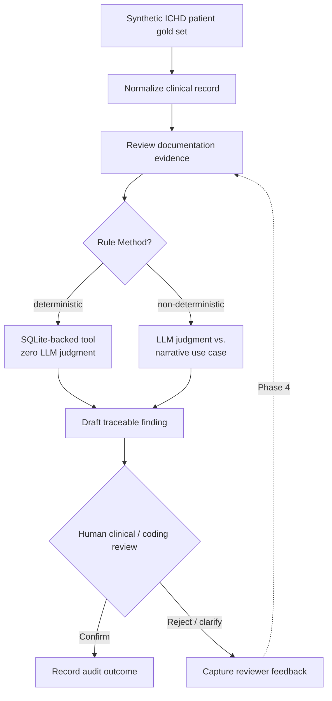
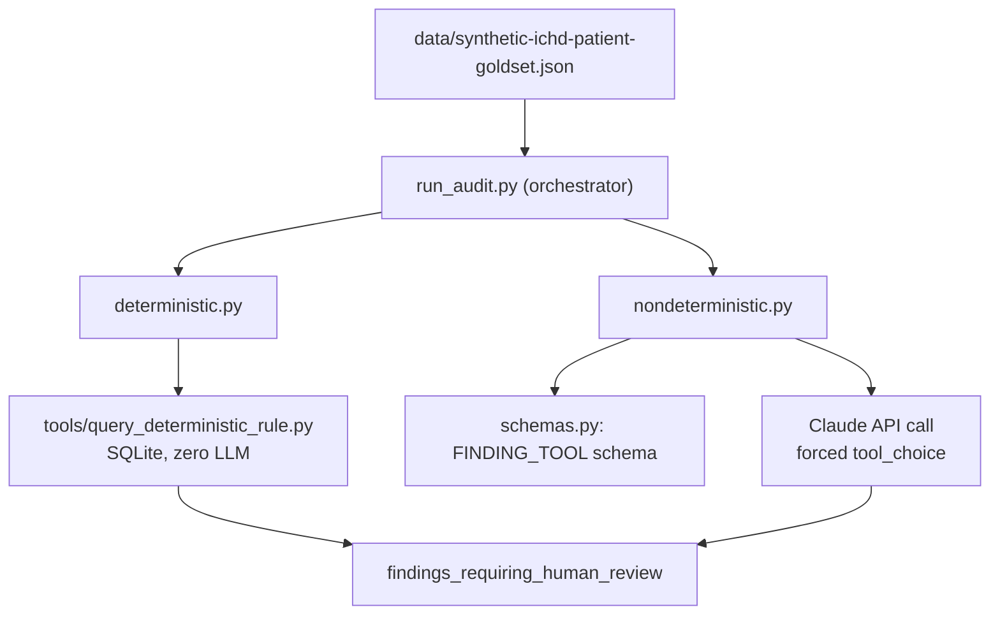

# In-center Hemodialysis (ICHD) Clinical Documentation Audit

> **Synthetic demonstration only.** Every patient, encounter, treatment, note, audit rule, evidence item, and finding in this repository is fictional mock data. This POC contains no client data, proprietary logic, production code, or client deliverables.

## What this is (30 seconds)

A governed, workflow-first AI approach to clinical documentation audit for in-center hemodialysis (ICHD) — reconstructing, on fully synthetic data, the architecture behind real DaVita documentation-audit work I led. An agent turns a synthetic patient record into a traceable draft finding; **a human always makes the actual clinical/coding call.**

The thing being demonstrated: **two audit rule types need two different mechanisms, and conflating them is a design mistake.** Deterministic rules (a treatment ran materially short, a treatment was missed) are resolved by a SQLite-backed tool — zero LLM judgment in the verdict. Non-deterministic rules (was a clinical event adequately documented) are resolved by LLM judgment against a narrative use case — never a rigid checklist. Same pipeline, same human-review gate, deliberately different resolution mechanism per rule.

This is an architectural communication artifact, not a clinical decision system and not a production implementation.

## Project Roadmap

Built in four numbered phases, each with its own PRD — this is the map, not the detail. **📍 Currently on Phase 3.**

| Phase | What | Status |
| --- | --- | --- |
| **Phase 1 — Claude Code + Skills** | The two-track audit workflow as Claude Code skills + a SQLite-backed tool | ✅ Done — [PRD](docs/prd-agentic-audit-tracks.md) |
| **Phase 2 — Claude SDK** | Same workflow, reimplemented as direct Python + Claude API calls — schema-enforced output, code-level determinism guarantee | ✅ Done — [PRD](docs/prd-claude-sdk-migration.md) |
| **Phase 3 — GitHub + Headless CI** 📍 | Branch → PR → CI (GitHub-hosted runners) → headless Claude Code reviews the diff as evidence → human approves → merge | 🚧 Designing — [PRD](docs/prd-github-headless-ci.md) |
| **Phase 4 — Evaluation Loop** | Capture reviewer feedback (confirm/reject/clarify) and feed it back into rule and prompt design | ⏳ Planned |

## How Phase 1 Works (Claude Code + Skills)

```mermaid
flowchart TD
    A["Synthetic ICHD patient gold set"] --> B["Normalize clinical record"]
    B --> C["Review documentation evidence"]
    C --> D{"Rule Method?"}
    D -->|deterministic| DT["SQLite-backed tool<br/>zero LLM judgment"]
    D -->|non-deterministic| ND["LLM judgment vs.<br/>narrative use case"]
    DT --> E["Draft traceable finding"]
    ND --> E
    E --> F{"Human clinical / coding review"}
    F -->|Confirm| G["Record audit outcome"]
    F -->|Reject / clarify| H["Capture reviewer feedback"]
    H -.Phase 4.-> C
```

The rule-evaluation step is a fork, not a single box — that's the whole thesis of this project, so the diagram shows it explicitly.

Six Claude Code skills implement this, each following the same shape (**Purpose → Workflow → Output Contract → Guardrails**) and each scoped to only the tools it needs (`allowed-tools` in its frontmatter). Run `clinical-audit-orchestrator` as the entry point.

| # | Skill | Track | Role |
| --- | --- | --- | --- |
| 1 | [`clinical-record-normalization`](.claude/skills/clinical-record-normalization/SKILL.md) | pipeline | Raw gold set → traceable evidence inventory |
| 2 | [`documentation-evidence-review`](.claude/skills/documentation-evidence-review/SKILL.md) | pipeline | Evidence inventory → cited statements for a candidate rule |
| 3 | [`audit-rule-evaluation`](.claude/skills/audit-rule-evaluation/SKILL.md) | dispatch | Reads the rule's Method and routes deterministic vs. non-deterministic |
| 4 | [`deterministic-rule-audit`](.claude/skills/deterministic-rule-audit/SKILL.md) | deterministic | `SYN-ICHD-01`/`09` — agent loops every treatment × every rule, tool resolves each one, zero LLM judgment |
| 5 | [`intradialytic-hypotension-review`](.claude/skills/intradialytic-hypotension-review/SKILL.md) | non-deterministic | `SYN-ICHD-04` — judges hypotension-event documentation against a narrative use case |
| 6 | [`treatment-refusal-review`](.claude/skills/treatment-refusal-review/SKILL.md) | non-deterministic | `SYN-ICHD-02` — judges treatment-refusal documentation against a narrative use case |
| 7 | [`clinical-audit-orchestrator`](.claude/skills/clinical-audit-orchestrator/SKILL.md) | pipeline | Top-level entry point; sequences 1→2→3, routes to human review |

`SYN-ICHD-03` (inherited from the original scaffold) is still listed in the rules table but not yet built out to this level — see `rules/synthetic-audit-rules.md` and Phase 1's PRD for the current, honest state of what's finished vs. placeholder.

**Try it yourself:** [`docs/testing-guide.md`](docs/testing-guide.md) has copy-pasteable prompts covering each track alone and both together.

## How Phase 2 Works (Claude SDK)

```mermaid
flowchart TD
    A["data/synthetic-ichd-patient-goldset.json"] --> B["run_audit.py (orchestrator)"]
    B --> C["deterministic.py"]
    C --> D["tools/query_deterministic_rule.py<br/>SQLite, zero LLM"]
    B --> E["nondeterministic.py"]
    E --> F["schemas.py: FINDING_TOOL schema"]
    E --> G["Claude API call<br/>forced tool_choice"]
    D --> H["findings_requiring_human_review"]
    G --> H
```

**Only one node in this diagram (`G`) ever touches the LLM.** Everything else — the orchestration, the deterministic loop, the tool schema, the Method dispatch — is plain Python we wrote, not an agent deciding what to do. That's the core difference from Phase 1's diagram above: same shape of workflow, but the "decide what to call" job moved from a Claude Code agent into our own code.

The coding structure maps onto Phase 1's skills, but doesn't reuse most of them at runtime — only the skill describing a genuine judgment task survives as an actual prompt:

| File | Corresponds to (Phase 1 skill) | Skill markdown read at runtime? |
| --- | --- | --- |
| `deterministic.py` | `deterministic-rule-audit` | No — the loop is a plain Python `for`, not agent-followed prose |
| `schemas.py` | `audit-rule-evaluation`'s Output Contract | No — the format is an enforced JSON schema, not requested in text |
| `nondeterministic.py` | `intradialytic-hypotension-review` | **Yes** — loads the skill's body at runtime as the prompt; this is the one task that's genuinely a judgment call |
| `run_audit.py` | `clinical-audit-orchestrator` + `audit-rule-evaluation`'s dispatch | No — Method dispatch is a hardcoded fact, not re-derived from a rules table |

Five of the six skill markdown files live under `claude-sdk-audit/skills/` (copied, not symlinked, from `.claude/skills/`) purely as reference — nothing in Phase 2's code reads them. Only `intradialytic-hypotension-review/SKILL.md` is an actual runtime dependency. See [`claude-sdk-audit/README.md`](claude-sdk-audit/README.md) for setup and how to run it, and `docs/prd-claude-sdk-migration.md` Section 12 for the full build log.

**Study reference:** [`docs/cheat-sheet.md`](docs/cheat-sheet.md) — every Claude Code / Claude SDK concept this project demonstrates, one line each.

## Repository Map

| Location | Contents |
| --- | --- |
| [`.claude/skills`](.claude/skills) / [`.agents/skills`](.agents/skills) | Phase 1 skill scaffold (mirrored for Claude Code and Codex) |
| [`claude-sdk-audit`](claude-sdk-audit) | Phase 2 — self-contained Claude SDK reimplementation (own `pyproject.toml`, own README) |
| [`data`](data) | Synthetic ICHD patient gold set + SQLite SOP store for deterministic rules (shared by both phases) |
| [`tools`](tools) | Deterministic rule lookup/evaluation tool (stdlib Python, no dependencies) + its tests (shared by both phases) |
| [`rules`](rules) | Illustrative, non-production audit rules, tagged deterministic vs. non-deterministic |
| [`outputs`](outputs) | Example traceable audit findings, positive and negative cases (Phase 1) |
| [`docs/cheat-sheet.md`](docs/cheat-sheet.md) | One-line-per-point study reference for every concept this project demonstrates |
| [`docs`](docs) | Safety/governance notes, per-phase PRDs, testing guide |

## Safety Boundary

This repository deliberately uses simplified, fictional examples. It must not be used for patient care, clinical coding, billing, coverage, quality reporting, or any real-world decision without qualified clinical, compliance, privacy, and legal review.
