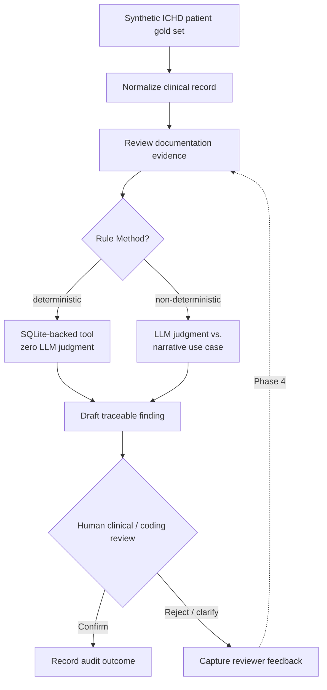
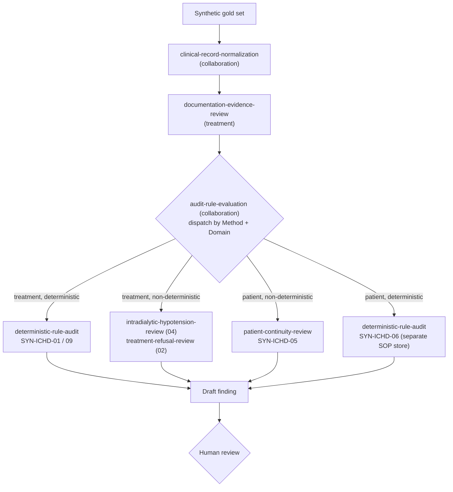
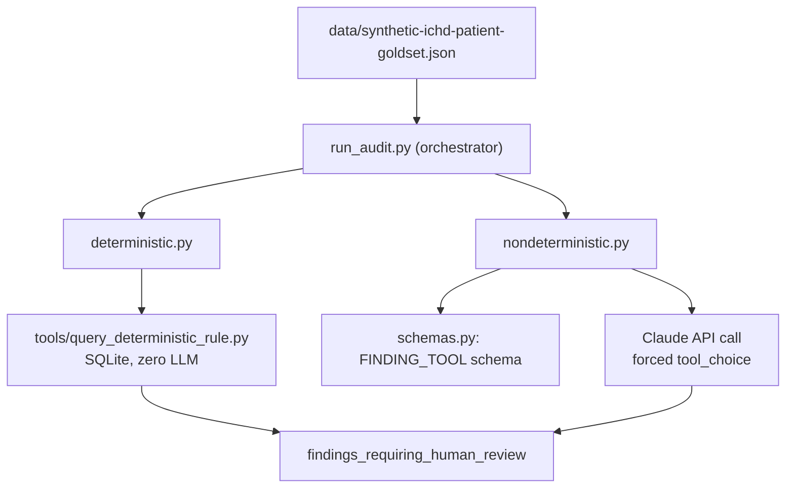
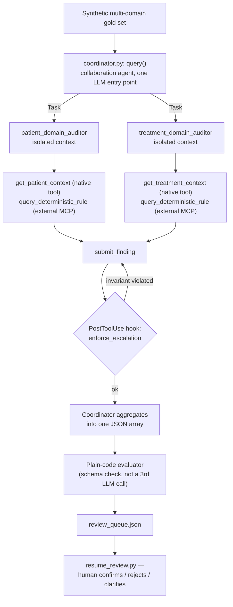
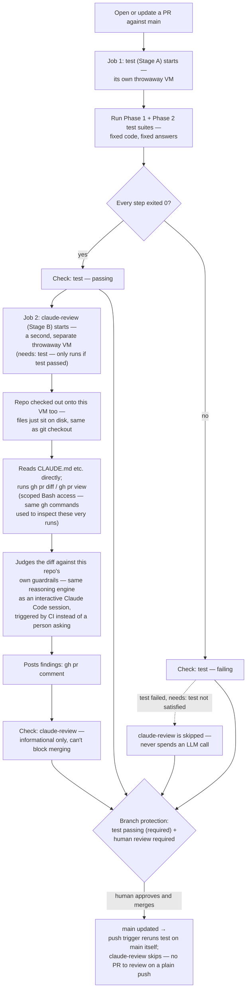

# In-center Hemodialysis (ICHD) Clinical Documentation Audit

> **Synthetic demonstration only.** Every patient, encounter, treatment, note, audit rule, evidence item, and finding in this repository is fictional mock data. This POC contains no client data, proprietary logic, production code, or client deliverables.

## What this is (30 seconds)

A governed, workflow-first AI approach to clinical documentation audit for in-center hemodialysis (ICHD) — reconstructing, on fully synthetic data, the architecture behind real DaVita documentation-audit work I led. An agent turns a synthetic patient record into a traceable draft finding; **a human always makes the actual clinical/coding call.**

The thing being demonstrated: **two audit rule types need two different mechanisms, and conflating them is a design mistake.** Deterministic rules (a treatment ran materially short, a treatment was missed) are resolved by a SQLite-backed tool — zero LLM judgment in the verdict. Non-deterministic rules (was a clinical event adequately documented) are resolved by LLM judgment against a narrative use case — never a rigid checklist. Same pipeline, same human-review gate, deliberately different resolution mechanism per rule.

This is an architectural communication artifact, not a clinical decision system and not a production implementation.

## Project Roadmap

Built in numbered phases, each with its own PRD — this is the map, not the detail. Phases pair by **implementation substrate**, not by when they were built: `1`↔`1.5` are both Skills; `2`↔`2.5` are both SDK; the `.5` half of each pair is the multi-agent variant of its parent. **📍 Currently on Phase 3** — 1, 1.5, 2, and 2.5 are all done; next is running the Phase 2.5 branch through the same CI/CD pipeline already built and exercised on Phase 1.5.

| Phase | What | Status |
| --- | --- | --- |
| **Phase 1 — Claude Code + Skills** | The two-track audit workflow as Claude Code skills + a SQLite-backed tool. Single flow, no domain split. | ✅ Done — [PRD](docs/prd-agentic-audit-tracks.md) |
| **Phase 1.5 — Multi-Agent Domain Split (Skills)** | Same substrate as Phase 1 (Skills only, orchestration is skill instructions, not code) — extended to a patient-domain vs. treatment-domain split plus a collaboration/orchestrator role, all validated inside Claude Code | ✅ Done — [PRD](docs/prd-multi-agent-domain-split.md) |
| **Phase 2 — Claude SDK** | Same Phase 1 workflow, reimplemented as direct Python + Claude API calls — schema-enforced output, code-level determinism guarantee. Single agent, no domain split. | ✅ Done — [PRD](docs/prd-claude-sdk-migration.md) |
| **Phase 2.5 — Multi-Agent Claude Agent SDK** | Port Phase 1.5's validated 3-role design into a real multi-agent implementation using the Claude Agent SDK, in [`claude-agent-sdk-audit/`](claude-agent-sdk-audit/) — real subagent isolation via the `Task` tool, not skill instructions | ✅ Done — [PRD](docs/prd-claude-agent-sdk-multi-agent.md) |
| **Phase 3 — GitHub + Headless CI** 📍 | Branch → PR → CI (GitHub-hosted runners) → headless Claude Code reviews the diff as evidence → human approves → merge | 🚧 Stage A + B built (Stage B informational-only, not yet a required check) — [PRD](docs/prd-github-headless-ci.md) |
| **Phase 4 — Evaluation Loop** | Capture reviewer feedback (confirm/reject/clarify) and feed it back into rule and prompt design | ⏳ Planned |

## How Phase 1 Works (Claude Code + Skills)

```mermaid
flowchart TD
    A["Synthetic ICHD patient gold set"] --> B["Normalize clinical record"]
    B --> C["Review documentation evidence"]
    C --> D{"Rule Method?"}
    D -->|deterministic| DT["SQLite-backed tool<br/>zero LLM judgment"]
    D -->|non-deterministic| ND["LLM judgment vs.<br/>narrative use case"]
    DT --> E["Draft traceable finding"]
    ND --> E
    E --> F{"Human clinical / coding review"}
    F -->|Confirm| G["Record audit outcome"]
    F -->|Reject / clarify| H["Capture reviewer feedback"]
    H -.Phase 4.-> C
```

The rule-evaluation step is a fork, not a single box — that's the whole thesis of this project, so the diagram shows it explicitly.

Six Claude Code skills implement this, each following the same shape (**Purpose → Workflow → Output Contract → Guardrails**) and each scoped to only the tools it needs (`allowed-tools` in its frontmatter). Run `clinical-audit-orchestrator` as the entry point.

| # | Skill | Track | Role |
| --- | --- | --- | --- |
| 1 | [`clinical-record-normalization`](.claude/skills/clinical-record-normalization/SKILL.md) | pipeline | Raw gold set → traceable evidence inventory |
| 2 | [`documentation-evidence-review`](.claude/skills/documentation-evidence-review/SKILL.md) | pipeline | Evidence inventory → cited statements for a candidate rule |
| 3 | [`audit-rule-evaluation`](.claude/skills/audit-rule-evaluation/SKILL.md) | dispatch | Reads the rule's Method and routes deterministic vs. non-deterministic |
| 4 | [`deterministic-rule-audit`](.claude/skills/deterministic-rule-audit/SKILL.md) | deterministic | `SYN-ICHD-01`/`09` — agent loops every treatment × every rule, tool resolves each one, zero LLM judgment |
| 5 | [`intradialytic-hypotension-review`](.claude/skills/intradialytic-hypotension-review/SKILL.md) | non-deterministic | `SYN-ICHD-04` — judges hypotension-event documentation against a narrative use case |
| 6 | [`treatment-refusal-review`](.claude/skills/treatment-refusal-review/SKILL.md) | non-deterministic | `SYN-ICHD-02` — judges treatment-refusal documentation against a narrative use case |
| 7 | [`clinical-audit-orchestrator`](.claude/skills/clinical-audit-orchestrator/SKILL.md) | pipeline | Top-level entry point; sequences 1→2→3, routes to human review |

`SYN-ICHD-03` (inherited from the original scaffold) is still listed in the rules table but not yet built out to this level — see `rules/synthetic-audit-rules.md` and Phase 1's PRD for the current, honest state of what's finished vs. placeholder.

**Try it yourself:** [`docs/testing-guide.md`](docs/testing-guide.md) has copy-pasteable prompts covering each track alone and both together.

## How Phase 1.5 Works (Multi-Agent Domain Split — Skills)

Same altitude as Phase 1 above — pure Claude Code Skills, no SDK, no native subagents — extended to validate a **patient-domain vs. treatment-domain split** before attempting the same split as a real multi-agent Claude Agent SDK implementation (Phase 2.5, previewed but not built — see the roadmap table). (One exception worth naming: `tools/query_deterministic_rule.py`, already Python since Phase 1, gained a `lt` operator and an optional `--db` flag so the patient domain could get a deterministic rule too — see `SYN-ICHD-06` below. That's extending existing infrastructure, not adding a new mechanism.)

```mermaid
flowchart TD
    A["Synthetic gold set"] --> B["clinical-record-normalization<br/>(collaboration)"]
    B --> C["documentation-evidence-review<br/>(treatment)"]
    C --> D{"audit-rule-evaluation (collaboration)<br/>dispatch by Method + Domain"}
    D -->|"treatment, deterministic"| E["deterministic-rule-audit<br/>SYN-ICHD-01 / 09"]
    D -->|"treatment, non-deterministic"| F["intradialytic-hypotension-review (04)<br/>treatment-refusal-review (02)"]
    D -->|"patient, non-deterministic"| G["patient-continuity-review<br/>SYN-ICHD-05"]
    D -->|"patient, deterministic"| J["deterministic-rule-audit<br/>SYN-ICHD-06 (separate SOP store)"]
    E --> H["Draft finding"]
    F --> H
    G --> H
    J --> H
    H --> I{"Human review"}
```

Compare against Phase 1's diagram above: same shape (normalize → evidence → Method fork → finding → human review), one more fork added (Domain) — not a different pipeline, a deepening of the same one.

Every skill now declares a **Domain** (`patient` / `treatment` / `collaboration`) right under its title — this labeling is the literal design contract Phase 2.5 will port into three real Claude Agent SDK subagents. Patient domain now has feature parity with treatment domain — both a deterministic rule (SQLite-backed, zero LLM) and a non-deterministic one (narrative judgment):

| Domain | Skills | Role |
| --- | --- | --- |
| **collaboration** | `clinical-record-normalization`, `audit-rule-evaluation`, `clinical-audit-orchestrator` | Sequencing, Method+Domain dispatch, human-review routing — owns no evidence itself |
| **treatment** | `documentation-evidence-review`, `intradialytic-hypotension-review`, `treatment-refusal-review`, `deterministic-rule-audit` (treatment-domain rules) | `SYN-ICHD-01/02/04/09` — unchanged from Phase 1 |
| **patient** | [`patient-continuity-review`](.claude/skills/patient-continuity-review/SKILL.md) (new, non-deterministic), `deterministic-rule-audit` (patient-domain check, new) | `SYN-ICHD-05` — nursing-note ↔ treatment continuity judgment. `SYN-ICHD-06` — deterministic, `nursing_notes_count < 3`, resolved against a **separate** SOP store, `data/audit_rules-multi-domain.db` |

`SYN-ICHD-05`/`06` need `patient.nursing_notes`, which only exists in a **new, separate data file**: [`data/synthetic-ichd-patient-goldset-multi-domain.json`](data/synthetic-ichd-patient-goldset-multi-domain.json). The original `data/synthetic-ichd-patient-goldset.json` is untouched on purpose — Phase 2 (`claude-sdk-audit/`) references it by relative path (not a copy), so changing its shape would silently break Phase 2's frozen regression tests. The same isolation applies to `SYN-ICHD-06`'s rule definition: it lives in `data/audit_rules-multi-domain.db`, never added to the shared `data/audit_rules.db` that Phase 2's `deterministic.py` also loops over. See [`docs/prd-multi-agent-domain-split.md`](docs/prd-multi-agent-domain-split.md) for the full design rationale and Section 10 for live test results, run in a real Claude Code session — both non-deterministic rules and both branches of the deterministic one, matched against their worked examples.

**Worked examples:** `SYN-ICHD-05` — [positive](outputs/sample-patient-continuity-finding-positive.md) / [negative](outputs/sample-patient-continuity-finding-negative.md); `SYN-ICHD-06` — [deterministic finding](outputs/sample-patient-continuity-deterministic-finding.md). Same convention as Phase 1's other tracks.

## How Phase 2 Works (Claude SDK)

```mermaid
flowchart TD
    A["data/synthetic-ichd-patient-goldset.json"] --> B["run_audit.py (orchestrator)"]
    B --> C["deterministic.py"]
    C --> D["tools/query_deterministic_rule.py<br/>SQLite, zero LLM"]
    B --> E["nondeterministic.py"]
    E --> F["schemas.py: FINDING_TOOL schema"]
    E --> G["Claude API call<br/>forced tool_choice"]
    D --> H["findings_requiring_human_review"]
    G --> H
```

**Only one node in this diagram (`G`) ever touches the LLM.** Everything else — the orchestration, the deterministic loop, the tool schema, the Method dispatch — is plain Python we wrote, not an agent deciding what to do. That's the core difference from Phase 1's diagram above: same shape of workflow, but the "decide what to call" job moved from a Claude Code agent into our own code.

The coding structure maps onto Phase 1's skills, but doesn't reuse most of them at runtime — only the skill describing a genuine judgment task survives as an actual prompt:

| File | Corresponds to (Phase 1 skill) | Skill markdown read at runtime? |
| --- | --- | --- |
| `deterministic.py` | `deterministic-rule-audit` | No — the loop is a plain Python `for`, not agent-followed prose |
| `schemas.py` | `audit-rule-evaluation`'s Output Contract | No — the format is an enforced JSON schema, not requested in text |
| `nondeterministic.py` | `intradialytic-hypotension-review` | **Yes** — loads the skill's body at runtime as the prompt; this is the one task that's genuinely a judgment call |
| `run_audit.py` | `clinical-audit-orchestrator` + `audit-rule-evaluation`'s dispatch | No — Method dispatch is a hardcoded fact, not re-derived from a rules table |

Five of the six skill markdown files live under `claude-sdk-audit/skills/` (copied, not symlinked, from `.claude/skills/`) purely as reference — nothing in Phase 2's code reads them. Only `intradialytic-hypotension-review/SKILL.md` is an actual runtime dependency. See [`claude-sdk-audit/README.md`](claude-sdk-audit/README.md) for setup and how to run it, and `docs/prd-claude-sdk-migration.md` Section 12 for the full build log.

**Study reference:** [`docs/cheat-sheet.md`](docs/cheat-sheet.md) — every Claude Code / Claude SDK concept this project demonstrates, one line each.

## How Phase 2.5 Works (Claude Agent SDK — Real Multi-Agent)

Phase 1.5 validated the patient/treatment/collaboration 3-role split as Claude Code Skills — orchestration lived in skill instructions, not code, and "isolation" between roles was a convention, not an enforced boundary. Phase 2.5 ports that same validated design into [`claude-agent-sdk-audit/`](claude-agent-sdk-audit/): real subagents with SDK-enforced isolated context, dispatched via the `Task` tool, with a code-level (not prompt-level) enforcement hook and a genuine pause/persist/resume human-review step.

```mermaid
flowchart TD
    A["Synthetic multi-domain gold set"] --> B["coordinator.py: query()<br/>collaboration agent, one LLM entry point"]
    B -->|Task| C["patient_domain_auditor<br/>isolated context"]
    B -->|Task| D["treatment_domain_auditor<br/>isolated context"]
    C --> E["get_patient_context (native tool)<br/>query_deterministic_rule (external MCP)"]
    D --> F["get_treatment_context (native tool)<br/>query_deterministic_rule (external MCP)"]
    E --> G["submit_finding"]
    F --> G
    G --> H{"PostToolUse hook:<br/>enforce_escalation"}
    H -->|invariant violated| G
    H -->|ok| I["Coordinator aggregates<br/>into one JSON array"]
    I --> J["Plain-code evaluator<br/>(schema check, not a 3rd LLM call)"]
    J --> K["review_queue.json"]
    K --> L["resume_review.py —<br/>human confirms / rejects / clarifies"]
```

Only one line of our own code ever calls the model (`coordinator.py`'s `query()`); every subagent turn, tool call, and Task dispatch happens *inside* that single call, driven by the model's own reasoning against `ClaudeAgentOptions` — not by Python control flow we wrote. See the file-by-file walkthrough in [`claude-agent-sdk-audit/README.md`](claude-agent-sdk-audit/README.md).

| File | Phase 1.5 skill equivalent | What's different this time |
| --- | --- | --- |
| `subagents.py` | `patient-continuity-review`, `intradialytic-hypotension-review`, `treatment-refusal-review`, `deterministic-rule-audit` (skill bodies) | Judgment criteria + worked few-shot examples embedded in `AgentDefinition.prompt`, not read from a skill file at runtime |
| `native_tools.py` | `Read(data/**)` path-scoped tool access (best-effort, unverified) | `get_patient_context`/`get_treatment_context` are real domain-scoped tools — a subagent physically cannot fetch the other domain's data; `submit_finding` forces the output schema |
| `mcp_server.py` | `tools/query_deterministic_rule.py` called directly | Same tool, now reached over MCP (external stdio server) instead of a direct Python import — the point of this file is demonstrating that transport, not new rule logic |
| `hooks.py` | "must call `submit_finding` exactly once, correct status" (a skill instruction) | Same rule, now enforced by a `PostToolUse` hook in code — a violation is rejected and resubmission is forced, not just requested in prose |
| `coordinator.py` | `clinical-audit-orchestrator` + `audit-rule-evaluation`'s dispatch | Dispatch is a real `Task`-tool decision made by a live LLM turn, not skill-to-skill sequencing inside one Claude Code session |
| `resume_review.py` | *(implicit — you, the person running Claude Code interactively, were the human)* | A genuinely separate, asynchronous step: findings are persisted to `review_queue.json` and reviewed later, not inline in the same session |

**Verified with a real end-to-end run** (not just code review): 31 findings — `SYN-ICHD-01`/`09` (deterministic, ×7 treatments each), `SYN-ICHD-06` (deterministic, patient-level, ×1), `SYN-ICHD-02`/`04` (non-deterministic, ×7 treatments each), `SYN-ICHD-05` (non-deterministic, ×2 nursing notes) — 8 triggered, matching Phase 1.5's worked examples exactly (same positive/negative pairs, same evidence gaps cited). Two build-time bugs are documented in the PRD: a module-naming collision that silently broke the external MCP server, and a non-blocking MCP connection race that silently dropped deterministic findings from the first live run — both fixed and reverified.

**A build note worth knowing if you extend this:** running `coordinator.py` authenticates via the same OAuth session as an interactive Claude Code login (`apiKeySource: "none"` in the SDK's own init message) — it rides the Claude.ai subscription, not a billed `ANTHROPIC_API_KEY`. A CI environment with no interactive login (see Phase 3 below) would need the API-key path instead.

## How Phase 3 Works (GitHub CI/CD)

Every trigger in this workflow is a fresh, throwaway virtual machine — GitHub calls it a "runner." Nothing persists between runs; the same steps happen identically whether it's the 1st run or the 100th.

```mermaid
flowchart TD
    A["Open or update a PR against main"] --> B["Job 1: test (Stage A) starts —<br/>its own throwaway VM"]
    B --> C1["Run Phase 1 + Phase 2 test suites —<br/>fixed code, fixed answers"]
    C1 --> C2{"Every step exited 0?"}
    C2 -->|yes| C3["Check: test — passing"]
    C2 -->|no| C4["Check: test — failing"]

    C3 --> D["Job 2: claude-review (Stage B) starts —<br/>a second, separate throwaway VM<br/>(needs: test — only runs if test passed)"]
    C4 -.->|"test failed, needs: test not satisfied"| D0["claude-review is skipped —<br/>never spends an LLM call"]
    D --> D1["Repo checked out onto this VM too —<br/>files just sit on disk, same as git checkout"]
    D1 --> D2["Reads CLAUDE.md etc. directly;<br/>runs gh pr diff / gh pr view<br/>(scoped Bash access — same gh commands<br/>used to inspect these very runs)"]
    D2 --> D3["Judges the diff against this repo's<br/>own guardrails — same reasoning engine<br/>as an interactive Claude Code session,<br/>triggered by CI instead of a person asking"]
    D3 --> D4["Posts findings: gh pr comment"]
    D4 --> D5["Check: claude-review —<br/>informational only, can't block merging"]

    C3 --> E{"Branch protection:<br/>test passing (required) +<br/>human review required"}
    C4 --> E
    D5 --> E
    D0 --> E
    E -->|human approves and merges| F["main updated →<br/>push trigger reruns test on main itself;<br/>claude-review skips — no PR to review on a plain push"]
```

| Stage | What runs | Status |
| --- | --- | --- |
| **Stage A — traditional CI** | This repo's existing test suites (Phase 1 + Phase 2), nothing else. No AI anywhere in the loop. **Does it work?** | ✅ Done — [`.github/workflows/ci.yml`](.github/workflows/ci.yml) |
| **Stage B — headless Claude Code review** | A second job (`needs: test`, only on `pull_request` events) where headless Claude Code reads the PR diff against this repo's conventions and posts findings via `gh pr comment` (`anthropics/claude-code-action@v1`). **Does it make sense?** | ✅ Built; verified end-to-end with a real posted review on PR #4 — informational only for now (not in `main`'s required checks yet), still gated by required human approval to merge either way — see [PRD](docs/prd-github-headless-ci.md) Section 8 for the full run-by-run log, including two PRs (#3, #5) where the App's own workflow-validation guard skipped the review because those PRs edited `ci.yml` itself |

Both checks feed into the same single human-approval gate at the bottom (`E`) — Stage B doesn't add a second approval step, it adds a second *input* to the one approval you were already going to make. That gate doesn't go away no matter how many automated checks feed into it; it's the same "human always decides" rule from Phases 1–2, just enforced by GitHub instead of by a skill's Workflow section.

**A note on what gets tested:** GitHub Actions doesn't inspect *what changed* — the workflow above runs unconditionally on every matching trigger, whether the diff is one line of markdown or every file in `claude-sdk-audit/`. (GitHub Actions does support a `paths:`/`paths-ignore:` filter on the trigger to skip runs for docs-only changes — a real, exam-relevant CI/CD concept — but this repo doesn't use it: the suite runs in well under a minute, so the safety of "always run everything" outweighs the speed gain, and it's one less place to misconfigure.) Interactively, in a Claude Code session, that judgment call is mine, not a built-in feature: editing only `README.md` doesn't touch any file the test suites import, so I skip re-running them locally — the same reasoning CI would need `paths:` to encode, done by hand instead.

**Try it yourself:** open a PR (or push a commit to a branch with one open) and run `gh run watch` — you'll see the trigger → VM created → steps run → VM destroyed lifecycle above happen in real time, in your own terminal.

## Repository Map

| Location | Contents |
| --- | --- |
| [`.claude/skills`](.claude/skills) / [`.agents/skills`](.agents/skills) | Phase 1 + Phase 1.5 skill scaffold, 8 skills (mirrored for Claude Code and Codex), each now tagged with a Domain |
| [`claude-sdk-audit`](claude-sdk-audit) | Phase 2 — self-contained, single-agent Claude SDK reimplementation (own `pyproject.toml`, own README). Frozen — not extended by Phase 1.5 or Phase 2.5. See below for the naming distinction from `claude-agent-sdk-audit/`. |
| [`claude-agent-sdk-audit`](claude-agent-sdk-audit) | Phase 2.5 — self-contained, real multi-agent Claude Agent SDK implementation (own `pyproject.toml`, own README). Ports Phase 1.5's 3-role design; not extended by later phases. |
| [`data`](data) | `synthetic-ichd-patient-goldset.json` — the original gold set, shared by Phase 1 and Phase 2 (Phase 2 references it by path, doesn't copy it — do not change its shape). `synthetic-ichd-patient-goldset-multi-domain.json` — a separate Phase 1.5 fixture adding `patient.nursing_notes`, used only by `patient-continuity-review`. Plus two SQLite SOP stores: `audit_rules.db` (original, shared) and `audit_rules-multi-domain.db` (Phase 1.5, patient-domain only). |
| [`tools`](tools) | Deterministic rule lookup/evaluation tool (stdlib Python, no dependencies) + its tests (shared by all phases) |
| [`rules`](rules) | Illustrative, non-production audit rules, tagged by Method (deterministic/non-deterministic) and Domain (treatment/patient) |
| [`outputs`](outputs) | Example traceable audit findings, positive and negative cases (Phase 1 + Phase 1.5) |
| [`docs/cheat-sheet.md`](docs/cheat-sheet.md) | One-line-per-point study reference for every concept this project demonstrates |
| [`docs`](docs) | Safety/governance notes, per-phase PRDs, testing guide |

**A naming note:** `claude-sdk-audit` (Phase 2, single agent, direct API calls) and `claude-agent-sdk-audit` (Phase 2.5, multi-agent, real Claude Agent SDK) are one word apart on purpose — the names track the actual architecture difference — but easy to misread at a glance. If you're looking at agent *count*: Phase 2 is one; Phase 2.5 is three (collaboration, patient, treatment) — the same three roles Phase 1.5 already validated at the Skills level.

## Safety Boundary

This repository deliberately uses simplified, fictional examples. It must not be used for patient care, clinical coding, billing, coverage, quality reporting, or any real-world decision without qualified clinical, compliance, privacy, and legal review.
