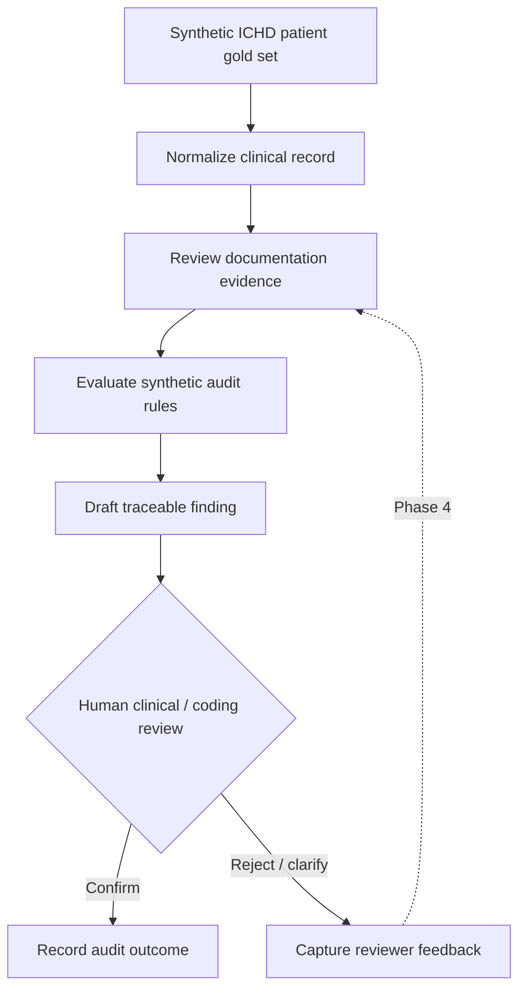

# In-center Hemodialysis (ICHD) Clinical Documentation Audit

> **Synthetic demonstration only.** Every patient, encounter, treatment, note, audit rule, evidence item, and finding in this repository is fictional mock data. This POC contains no client data, proprietary logic, production code, or client deliverables.

## What this is (30 seconds)

A governed, workflow-first AI approach to clinical documentation audit for in-center hemodialysis (ICHD) — reconstructing, on fully synthetic data, the architecture behind real DaVita documentation-audit work I led. An agent turns a synthetic patient record into a traceable draft finding; **a human always makes the actual clinical/coding call.**

The thing being demonstrated: **two audit rule types need two different mechanisms, and conflating them is a design mistake.** Deterministic rules (a treatment ran materially short, a treatment was missed) are resolved by a SQLite-backed tool — zero LLM judgment in the verdict. Non-deterministic rules (was a clinical event adequately documented) are resolved by LLM judgment against a narrative use case — never a rigid checklist. Same pipeline, same human-review gate, deliberately different resolution mechanism per rule.

This is an architectural communication artifact, not a clinical decision system and not a production implementation.

## Project Roadmap

Built in four phases, each with its own PRD — this is the map, not the detail.

| Phase | What | Status |
| --- | --- | --- |
| **1. Claude Code + Skills** | The two-track audit workflow as Claude Code skills + a SQLite-backed tool | ✅ Done — [PRD](docs/prd-agentic-audit-tracks.md) |
| **2. Claude SDK** | Same workflow, reimplemented as direct Python + Claude API calls — schema-enforced output, code-level determinism guarantee | 🔜 Next — [PRD](docs/prd-claude-sdk-migration.md) |
| **3. GitHub + Headless CI** | Push to GitHub; PR automation via Claude Code headless mode on a self-hosted VM | ⏳ Planned |
| **4. Evaluation Loop** | Capture reviewer feedback (confirm/reject/clarify) and feed it back into rule and prompt design | ⏳ Planned |

## How Phase 1 Works

```mermaid
flowchart TD
    A["Synthetic ICHD patient gold set"] --> B["Normalize clinical record"]
    B --> C["Review documentation evidence"]
    C --> D["Evaluate synthetic audit rules"]
    D --> E["Draft traceable finding"]
    E --> F{"Human clinical / coding review"}
    F -->|Confirm| G["Record audit outcome"]
    F -->|Reject / clarify| H["Capture reviewer feedback"]
    H -.Phase 4.-> C
```

Six Claude Code skills implement this, each following the same shape (**Purpose → Workflow → Output Contract → Guardrails**) and each scoped to only the tools it needs (`allowed-tools` in its frontmatter). Run `clinical-audit-orchestrator` as the entry point.

| # | Skill | Track | Role |
| --- | --- | --- | --- |
| 1 | [`clinical-record-normalization`](.claude/skills/clinical-record-normalization/SKILL.md) | pipeline | Raw gold set → traceable evidence inventory |
| 2 | [`documentation-evidence-review`](.claude/skills/documentation-evidence-review/SKILL.md) | pipeline | Evidence inventory → cited statements for a candidate rule |
| 3 | [`audit-rule-evaluation`](.claude/skills/audit-rule-evaluation/SKILL.md) | dispatch | Reads the rule's Method and routes deterministic vs. non-deterministic |
| 4 | [`deterministic-rule-audit`](.claude/skills/deterministic-rule-audit/SKILL.md) | deterministic | `SYN-ICHD-01`/`09` — agent loops every treatment × every rule, tool resolves each one, zero LLM judgment |
| 5 | [`intradialytic-hypotension-review`](.claude/skills/intradialytic-hypotension-review/SKILL.md) | non-deterministic | `SYN-ICHD-04` — judges hypotension-event documentation against a narrative use case |
| 6 | [`clinical-audit-orchestrator`](.claude/skills/clinical-audit-orchestrator/SKILL.md) | pipeline | Top-level entry point; sequences 1→2→3, routes to human review |

`SYN-ICHD-02`/`03` (inherited from the original scaffold) are still listed in the rules table but not yet built out to this level — see `rules/synthetic-audit-rules.md` and Phase 1's PRD for the current, honest state of what's finished vs. placeholder.

**Try it yourself:** [`docs/testing-guide.md`](docs/testing-guide.md) has copy-pasteable prompts covering each track alone and both together.

## Repository Map

| Location | Contents |
| --- | --- |
| [`.claude/skills`](.claude/skills) / [`.agents/skills`](.agents/skills) | Skill-based workflow scaffold (mirrored for Claude Code and Codex) |
| [`data`](data) | Synthetic ICHD patient gold set + SQLite SOP store for deterministic rules |
| [`tools`](tools) | Deterministic rule lookup/evaluation tool (stdlib Python, no dependencies) + its tests |
| [`rules`](rules) | Illustrative, non-production audit rules, tagged deterministic vs. non-deterministic |
| [`outputs`](outputs) | Example traceable audit findings, positive and negative cases |
| [`docs`](docs) | Safety/governance notes, per-phase PRDs, testing guide |

## Safety Boundary

This repository deliberately uses simplified, fictional examples. It must not be used for patient care, clinical coding, billing, coverage, quality reporting, or any real-world decision without qualified clinical, compliance, privacy, and legal review.
